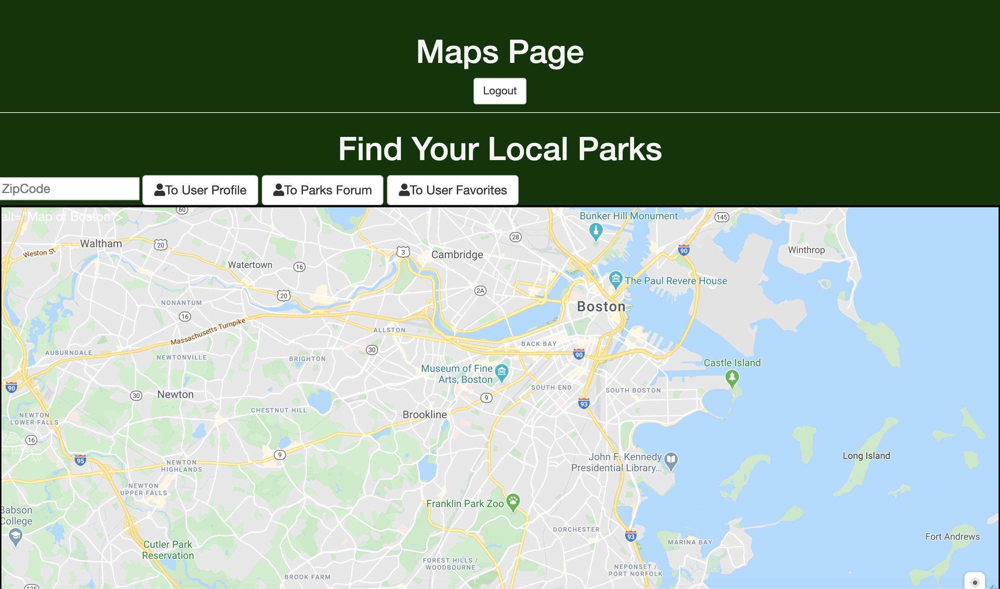

## Demo Day Skeleton

Parks and Recreation App
Find Local parks added by users as well as workouts that are tailoored for the locations. Save favorite Workouts and Park Locations to a Favorite Page. Use Map to quickly Find the Park closest to you  

## Tech Used

JavaScript 
HTML
CSS
Express
MongoDB

## Left To Do

-Implement a Map API that can add locations from the DB. 
    Also be able to pin those locations to the map
    via lattitude and longitude
-Fix the favorites page so that the put updates and saves them there
-Fix the POST req so they define the correct objs to database

